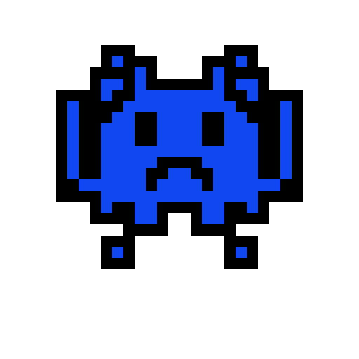

# Game Name

## Elevator Pitch

Syntax sprint transforms the struggle of learning new syntax into an exciting arcade-style experience that helps players internalize correct syntax patterns through active gameplay

## Influences (Brief)

- *Pacman*:
  - Medium: *Game*
  - Explanation: *The game navigates the player through a maze and they collect powerups while avoiding the enemies*

## Core Gameplay Mechanics (Brief)

- *Move the player using arrow-keys*
- *Avoid getting killed by enemies*
- *Player needs to collect the correct token to progress to the next level*
- *Collecting incorrect tokens may lead to spawning more enemies*
- *There are five rounds in a world with new tokens spawning when a player completes a round. Each world focuses on a different programming language*
- *Minigames between rounds will have the player answering a programming question or coding to proceed*
- *There is a time limit within which the player needs to collect all the correct tokens*
- *The player starts off with 3 lives. Each time the player hits an enemy, they lose a life.*
- *The player must successfully complete all rounds in all worlds to win the game*

# Learning Aspects

## Learning Domains

*Introductory programming*

## Target Audiences

- *Beginner programmers with little-to-no programming experience.*
- *Programmers struggling with syntax differences between different programming languages.*

## Target Contexts

*k-12 computer labs during free time, fun game for self-motivated programmers*

## Learning Objectives

- *By the end of the instruction, students should be able to identify between different syntax in the same language*
- *By the end of the instruction, students should be able to distinguish between syntax in different programming languages*

## Prerequisite Knowledge

- *Prior to the game, players need to be familiar with some syntax in Python*
- *Prior to the game, players need to be familiar with some syntax in Java*
- *Prior to the game, players need to be familiar with some syntax in JavaScript*

## Assessment Measures

- * Being able to beat the game  *
- * Being able to beat the game in a shortened time period (creating a new high score)*

# What sets this project apart?

- *There are not many games that are focused on learning syntax that are not quiz-like (gamified quiz)*
- *Many introductory programming courses do not test students' ability to identify different languages. This game bridges this gap*
- *By playing this game, players can have fun while learning something.*

# Player Interaction Patterns and Modes

## Player Interaction Pattern

*This game is for one-person but can be multiplayer too. Both players play on the same system - one player uses WASD and the other uses the arrow-keys to move.
Note: The single player mode is the primary mode of interaction in the game. We will only implement multi-player mode if we have enough time to*

## Player Modes

- *Single-player*: *player repeatendly advances through the rounds to reach the end*
- *Multi-player (if we have time to implement)*: *players compete against each-other to complete the tasks fastest*

# Gameplay Objectives

- *Collect all correct tokens*:
    - Description: *Players need to collect the right syntax token to advance to the next round. There is only one correct syntax token per level and multiple incorrect syntax tokens. The incorrect syntax tokens are either in another programming language or with a slightly different variation in language*
    - Alignment: *This teaches the player to identify the right syntax in a given programming language fast and within a time limit. These tokens are analogous to the 'pills' in PacMan. Unlike PacMan there are no 'powerups' to help the player.*
- *Complete all rounds*:
    - Description: *Players need to complete all rounds to complete the game *
    - Alignment: *This teaches the players to distinguish between syntax in different programming languages*
- *Avoid the Enemies*:
    - Description: *Players need to avoid the enemies and keep moving to complete the round. They lose a heart every time they touch a villain and need to retain at least one heart to keep playing*
    - Alignment: *This keeps the player moving in the game and keeps them interacting with the game.*

# Procedures/Actions

*Players use the left-arrow key to move left, right-arrow key to move right, up-arrow key to move up, down-arrow key to move down*

# Rules

- *If the player hits an enemy, they lose a heart*
- *If the player loses all hearts, they lose the game*
- *If the player collects the correct token, they proceed to the next round*
- *If the player completes all rounds, they will advance to the next world*
- *If the player collect a wrong token, more enemies are spawned*

# Objects/Entities

- * Robot icon main character *
- * Bug enemy (like the emoji) *
- * Tokens that look like text boxes *
- * Heart icons that define how many hearts the player has remaining * 

## Core Gameplay Mechanics (Detailed)

- *Moving the character*: *The character moves according to the arrow keys. The character does not move continuously and can move as many blocks and spaces as the player wants*
- *Completing within the time-limit: *The player should complete each round within the time limit. The time limit starts off as 5 minutes for each round and decreases with each passing round - making the game more challenging and exciting to play*
- *Correctly advancing through the rounds*: *The player must navigate through the maze to collect the correct token within the time-limit to advance to the next round. Each round will have one correct and multiple incorrect tokens.*
- *Collecting the incorrect token:  * If the player collects an incorrect token, the number of enemies chasing the player increases*
- *Advancing through the worlds*: *If the player completes all the rounds (5-6 rounds per world), they will advance to the next world which will be set in another programming language*
- *Losing the game*: *If the player interacts with an enemy, they lose a heart. If they player loses all hearts, they lose the game.*

    
## Feedback

- *Collecting the right token will produce a positive feedback sound (like a ding)*
- *Collecting the wrong token will produce a negative feedback sound (like a dun dun dun)*
- *Text on the screen will show which world you are in (which programming language you are learning) and which round you are in *
- *The number of hearts will always be displayed on the screen. The player will be respawned in the center with 3 seconds of immunity if they die/lose a heart because they interacted with an enemy.*

# Story and Gameplay

## Presentation of Rules

*Initial text on the screen (title screen) will show the rules at the beginning*

## Presentation of Content

*The game does not attempt to teach the content. There is feedback if the player chooses the wrong/right token so the player may learn as they go*

## Story (Brief)

*You want to navigate the maze to get out, and the only way to do so is to collect the right tokens and advance through the worlds*

## Storyboarding

# Assets Needed

## Aethestics

*Pixel art, arcade style music and art. Music and sound effects to guide the player*

## Graphical

- Characters List
  - *Main character: player can choose from a list of characters to play with*
  - *Villain: bug-emoji like creature*
- Textures:
  - N/A
- Environment Art/Textures:
  - A maze with an arcade style background

  
## Audio

*Game region/phase/time are ways of designating a particularly important place in the game.*

- Music List (Ambient sound)
  - *background game play music*: *fun arcade style music (think super mario bros)*
  - *background game play music when 30 seconds left*: *sped-up fun arcade style music*
  
*Game Interactions are things that trigger SFX, like character movement, hitting a spiky enemy, collecting a coin.*

- Sound List (SFX)
  - *Collecting a right token*: *Level-up type sound (like super mario bros too)*
  - *Collecting a wrong token*: *Sad/Disappointing sound effect*

# Metadata

* Template created by Austin Cory Bart <acbart@udel.edu>, Mark Sheriff, Alec Markarian, and Benjamin Stanley.
* Version 0.0.3
