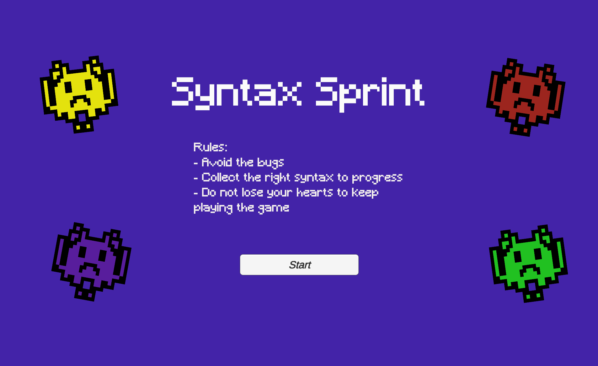
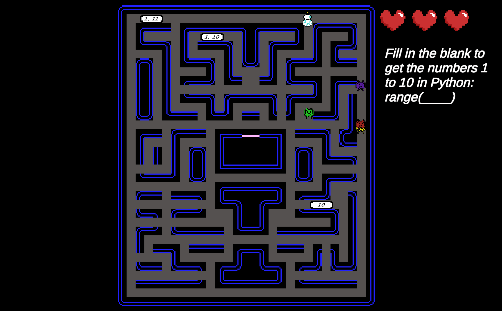

# Syntax Sprint

Navigate through challenging worlds and avoid enemies as you learn the foundations of programming! In this fast-paced educational game, players must collect tokens with correct syntax while dodging obstacles and adversaries. Whether you're avoiding bugs or jumping through worlds, each level reinforces your understanding of loops, conditionals, variables, and more. Get immediate feedback on your choices and track your progress as you go. Perfect for beginners or anyone looking to sharpen their skills in a fun, interactive way, this game turns coding practice into an exciting adventure through logic, problem-solving, and quick thinking.

# Developers
- Malika Iyer (malika@udel.edu)
- Daniel Fazzari (dfazzari@udel.edu)
- Abdullah (amaruf@udel.edu)

# Basic Instructions
- Use the arrow keys or WASD to control the bug
- Run through the worlds, each set in a different language, to complete the game
- Each world has 5 rounds with a question to answer. Correct the right token to progress through the level.
- Avoid the bugs to avoid losing hearts. Losing all hearts will lead to Game Over.

# Screenshot
 

# Gameplay Video
- (Coming Soon)

# Education Game Design Document
- [EGDD.md](EGDD.md)

# Credits and Acknowledgements
- Background Music - moodmode (https://pixabay.com/music/video-games-8-bit-music-on-medium-245247/)
- Round Complete Sound Effect - Universfield (https://pixabay.com/sound-effects/game-bonus-2-294436/)
- Wrong Token Sound Effect - freesound_community (https://pixabay.com/sound-effects/invalid-selection-39351/)
  
  # Credits and Acknowledgements
- Final presentation:
- Deployed game URL: 
